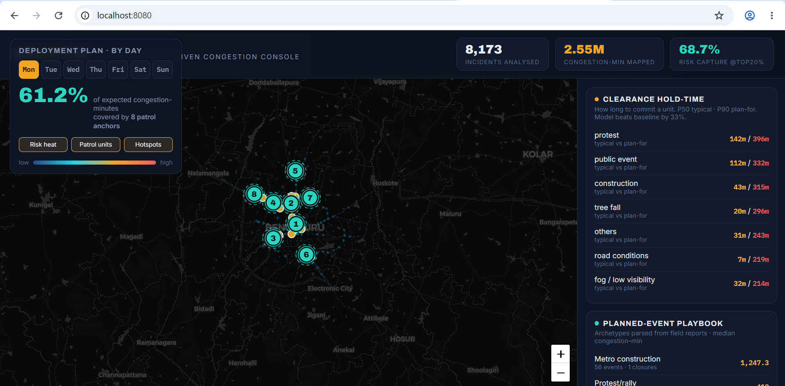

# 🚦 SAARTHI

**Spatio-temporal Allocation, Anomaly & Risk Triage for High-impact Incidents**

> Turning Bengaluru Traffic Police's raw incident log into a deployment console that
> forecasts congestion, sizes and places the force, recommends barricading & diversion,
> and learns after every event.

*Gridlock Hackathon 2.0 (Flipkart × Bengaluru Traffic Police) — Theme 2: Event-Driven Congestion (Planned & Unplanned). Built by **Team A2K**.*

🌐 **Live Console Link**: [saarthi-traffic-allocator.vercel.app](https://saarthi-traffic-allocator.vercel.app/)

> [!IMPORTANT]
> **Optimized for Desktop (Laptops/PCs)**: The interactive ops console is designed for large-screen monitoring. Please view it on a laptop or PC for the best map visualisations and control experience (not optimized for mobile screens).



---

## The one idea that drives everything

Most approaches forecast **how many** events happen. SAARTHI forecasts **expected
congestion-minutes** — one physical currency — and then **optimally pre-positions
scarce enforcement units against it**. That single reframe answers all three of the
problem statement's asks in one system: **forecast impact → recommend manpower /
barricading / diversion → learn after every event.**

And before modelling anything, SAARTHI defuses **two traps hidden in this dataset**
that a naive "count events per hour" pipeline walks straight into:

| Trap | What's wrong | What we do |
|---|---|---|
| **Time is corrupted** | Raw hour-of-day peaks at **2 AM** — a timezone-tagging + batch-creation artifact, not rush hour | Drop absolute hour; key only on day-of-week, month, day-part |
| **Clearance time is mostly fake** | `closed_datetime` is largely a **batch auto-close** piling durations into a synthetic 2–3 h band | Flag those rows as right-censored; learn clearance from the trustworthy signal only |

These two corrections are a credibility separator: a model trained on the raw fields
is confidently wrong.

---

## What it does

- **Quantifies impact in advance** — a Congestion-Impact Quantifier (CIQ) scores every
  incident in congestion-minutes = severity × corridor-criticality × expected clearance.
  **2.55M congestion-minutes** mapped across the window.
- **Forecasts the risk surface** — a spatio-temporal gradient-boosting model over a
  241-cell grid × day-of-week. Validated on the operational metric that matters:
  **its top-20% of cells capture ~69% of the next month's real congestion-minutes** on
  30 unseen days.
- **Predicts clearance hold-time** — quantile model (P50 typical, P90 plan-for) per
  cause, **33% sharper** than a flat average. Answers "how long to commit a unit."
- **Pre-positions patrol units** — a greedy max-coverage optimizer places anchors to
  maximise covered congestion-minutes, with a **marginal coverage curve**
  (≈6 units → 50%, 10 → 70%, 14 → 80%) so the force can be sized to a target.
- **Recommends barricading** — clusters real closure approaches into ranked barricade
  zones with named junctions (K R Circle, K R Market, Silk Board…), point counts, and
  the diversion corridor to turn traffic onto.
- **Recommends diversion** — mines a **corridor spillover network**: an incident on
  corridor A triggering a follow-on on nearby corridor B within 90 min. E.g.
  **Hosur Road → IRR/Thanisandra at 28× chance (167 observed cascades)**. Reroutes are
  recommended onto parallel corridors *outside* the blast radius.
- **Quantifies system-level impact** — direct + derived cascaded total per corridor,
  e.g. **Hosur Road: 103k direct + 85k cascaded = 188k (×1.82 amplification)**.
- **Detects sudden gatherings / emerging events** — a spatio-temporal burst alarm
  (≥4 incidents, 1.5 km, 90 min), made artifact-robust so it ignores batch surveys and
  fires on real events — it caught the **7 Mar 2024 city-wide rain flooding** live.
- **Learns after every event** — a **walk-forward** loop re-fits weekly on past data
  only and is scored on the next unseen week. Over 13 weeks capture holds and rises
  (~61% → ~69%) — the nightly re-fit, *proven in code, not claimed*.
- **What-if simulator** — pick a planned event (cricket at Chinnaswamy, Metro works, a
  protest) and the optimizer **re-runs live in the browser** to re-place units for that
  day, with the hold time.
- **Live force-sizing slider** — drag the number of patrol units (K = 2…16) and watch
  the anchors and coverage % recompute instantly — sizing manpower against coverage in
  real time.
- **Drop-a-pin custom event** — click anywhere on the map, set an estimated impact, and
  the optimizer re-positions units around it — for unannounced rallies or emergencies
  at arbitrary locations, not just historical archetypes.
- **Counterfactual back-test — "would it have helped?"** Most teams *propose* a plan;
  we *evaluate* ours against history. If SAARTHI's units had been pre-positioned, an
  estimated **21% of congestion-minutes (~468k) were preventable**, reaching **51% of
  all incidents** and **56% of the high-impact ones**. This reframes the work from a
  predictor into a *validated intervention*.
- **Equity lens** — the optimizer naturally favours central arterials, leaving the
  periphery starved (**Central ~85% reach vs East Zone ~5%** — an 80-point gap). We
  surface this fairness trade-off and quantify the cost of a coverage floor, rather
  than hide it.
- **Confidence self-audit** — a "Blind spots" map layer flags the zones where the
  forecast is *least* trustworthy (thin history or batch-artifact-heavy). Showing our
  own failure regions is a maturity signal no pure-optimization entry will volunteer.

---

## How it maps to the problem statement

| Requirement (verbatim from the brief) | Status |
|---|:--:|
| Forecast event-related traffic **impact** | ✅ |
| Recommend optimal **manpower** | ✅ |
| Recommend **barricading** | ✅ |
| Recommend **diversion plans** | ✅ |
| Gap: "impact not quantified in advance" | ✅ |
| Gap: "deployment is experience-driven" | ✅ |
| Gap: "no post-event learning system" | ✅ |
| Event types: rallies · festivals · sports · construction · sudden gatherings | ✅ |

---

## Architecture

```mermaid
flowchart LR
    A[Astram raw log<br/>8,173 incidents] --> B[1 · Data Spine<br/>clean + defuse 2 traps + CIQ]
    B --> C[2 · Models<br/>risk surface + clearance quantiles]
    C --> D[3 · Network<br/>spillover + diversion + coverage curve + anomaly]
    D --> E[4 · Ops<br/>barricading + walk-forward learning + gathering alarm]
    E --> F[5 · Scenarios<br/>what-if + cascade totals + urgency tiers]
    F --> G[5b · Impact<br/>counterfactual + equity lens + self-audit]
    G --> H[6 · Dashboard<br/>interactive ops console → index.html]
```



Each stage writes a JSON/CSV feed that the next stage reads; the final stage renders a
single self-contained console.

---

## Quick start

```bash
git clone <your-repo-url> saarthi
cd saarthi
pip install -r requirements.txt

# run the full pipeline (cleans data → trains models → builds the console)
python run_all.py

# then open index.html in any browser
```

The raw anonymized dataset ships in `data/astram_events.csv`. To point at a different
file or output folder:

```bash
SAARTHI_DATA=/path/to/data.csv SAARTHI_OUT=/path/to/out python run_all.py
```

> **Offline-ready:** Leaflet is vendored locally (`assets/vendor/`), and if the map
> tiles can't load (no internet at a venue) the base map is hidden but **all data
> layers keep rendering** — the demo never hard-fails.

---

## Repository structure

```
saarthi/
├── run_all.py              # one command runs the whole pipeline
├── requirements.txt
├── index.html              # the interactive console (generated by stage 6)
├── data/
│   └── astram_events.csv   # raw anonymized Astram incident log
├── src/
│   ├── 1_pipeline.py       # clean + defuse traps + CIQ congestion-impact
│   ├── 2_models.py         # spatio-temporal risk + clearance quantile models
│   ├── 3_network.py        # spillover cascade + diversion + coverage curve + anomaly
│   ├── 4_ops.py            # barricading + walk-forward learning + gathering alarm
│   ├── 5_scenarios.py      # what-if simulator feed + cascade totals + urgency tiers
│   ├── 5b_impact.py        # counterfactual + equity lens + confidence self-audit
│   └── 6_dashboard.py      # builds index.html from the JSON feed
├── outputs/                # generated feeds (git-ignored; regenerate with run_all.py)
├── assets/
│   ├── vendor/             # Leaflet (vendored for offline use)
│   └── images/
└── docs/
    └── SUBMISSION.md       # concept note + 90-second demo script
```

---

## Key results

| Metric | Value | How it's validated |
|---|---|---|
| Risk capture @ top-20% cells | **68.7%** | 30 unseen days |
| Clearance model vs baseline | **33% lower MAE** | held-out 30 days |
| Walk-forward learning capture | **~61% → ~69%**, 13 weeks | train-on-past, score-next-week |
| Deployment coverage (8 units) | **~62–66%** of congestion-min/day | per day-of-week |
| Strongest cascade | **Hosur Rd → Thanisandra ×28** | 167 observed transitions |
| Congestion-minutes quantified | **2.55M** | full window |

---

## Tech stack

Python · pandas · NumPy · scikit-learn (HistGradientBoosting) · Leaflet.js · vanilla
JS/SVG (no framework, fully self-contained console).

---

## Limitations & next steps (stated honestly)

- Spillover lift is a spatio-temporal **co-occurrence** signal (validated against
  arterial geometry), **not proven causation** — a routed road-network graph is the
  rigorous upgrade.
- Risk-model gain over a cell-mean baseline is modest on raw error; **capture rate** is
  the honest operational win. A self-exciting (Hawkes) point process is the next model.
- Clearance ground truth is thin (human-resolved rows are rare); full survival analysis
  with explicit censoring (`lifelines`) is the next step.
- The learning loop is proven offline by walk-forward; wiring it to a **live** Astram
  feed is a deployment task — the same code runs unchanged.

---

## Team

**Team A2K** — Gridlock Hackathon 2.0, Flipkart × Bengaluru Traffic Police.

Dataset © Bengaluru Traffic Police (Astram), provided anonymized for the hackathon.
Code released under the MIT License.
