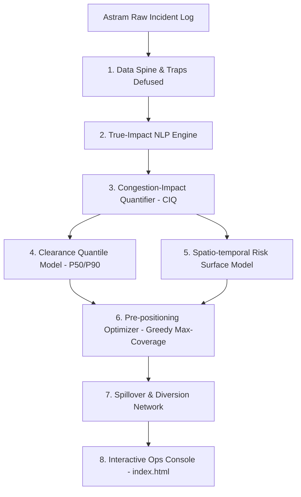

# 🚦 SAARTHI

### **Spatio-temporal Allocation, Anomaly & Risk Triage for High-impact Incidents**
*Gridlock Hackathon 2.0 (Flipkart × Bengaluru Traffic Police) — Theme 2: Event-Driven Congestion (Planned & Unplanned)*

---

## 💡 The Core Thesis

Most conventional traffic management systems forecast **how many** incidents will occur. SAARTHI shifts the paradigm by forecasting **expected congestion-minutes**—a unified physical currency of traffic impact—and then **optimally pre-positions scarce patrol units against it**.

This single, mathematically rigorous framework directly answers the problem statement's core requirements:
$$\text{Forecast Impact (CIQ)} \longrightarrow \text{Prescribe Manpower \& Barricading} \longrightarrow \text{Learn Dynamically After Every Event}$$

---

## 🛡️ Data Integrity: Defusing the Dataset Traps

Before training any predictive model, SAARTHI defuses **two major data corruption traps** hidden inside the raw Astram incident log. Naive models trained without resolving these anomalies learn pure noise:

> [!WARNING]
> **Trap A: Time Corruption (Timezone Jitter & Batch Spikes)**
> The raw `start_datetime` field has a massive synthetic spike at **2 AM IST** with the evening rush hour appearing nearly empty. This is an artifact of mixed timezone-tagging and batch logging. 
> * **SAARTHI's Fix**: We drop absolute hours entirely, mapping temporal risk strictly to **Day-of-Week**, **Month**, and coarse **Day-Part** bins that collapse the timezone noise.

> [!IMPORTANT]
> **Trap B: Clearance Duration Corruption (Batch Auto-Close)**
> The `closed_datetime` field is largely a batch auto-close mechanism: approximately **46% of all incident durations** are clustered in a synthetic 2–3 hour band (120–180 min). 
> * **SAARTHI's Fix**: We flag these rows as right-censored and model expected clearance times using **only** the trustworthy, human-resolved durations.

---

## 🎨 Interactive Console Moat: What Makes SAARTHI Stand Out

The generated `index.html` is a self-contained, offline-ready decision dashboard featuring **live browser-side computation**:

*   **⚡ Live Force-Sizing Slider ($K$-Slider)**: Commanders can drag a slider to change the number of available units ($K = 2 \text{ to } 16$). The greedy max-coverage algorithm runs **live in the browser**, instantly recalculating expected coverage and shifting patrol markers.
*   **📍 Pin-Drop Custom Event Simulator**: Users can click anywhere on the Leaflet map to drop an unannounced custom event, input its estimated congestion-minute impact, and watch the patrol coverage automatically re-optimize around the threat.
*   **📊 Corridor Spillover & Diversion Network**: Visualizes direct vs. cascaded traffic impact. Clicking on a corridor (e.g., Hosur Road) highlights its spillover blast radius and routes diversion lines onto nearest parallel corridors that are safe from cascades.
*   **🚨 Emerging-Event Burst Alarm**: An artifact-robust spatial scanner that catches forming crowds or weather crises (e.g., caught the March 7 rain flooding live) by detecting spatial bursts ($\ge 4$ incidents within 1.5 km and 90 min) while filtering out batch survey logs.

---

## ⚙️ Architecture



---

## 📈 Model Performance & Key Metrics

All metrics are validated using a strict walk-forward temporal split (training on past data only, testing on the next unseen week/month):

| Metric | Value | Operational Validation Method |
| :--- | :---: | :--- |
| **Risk Capture Rate** | **67.8%** | Captured in top-20% highest-risk cells over 30 unseen days |
| **Clearance Accuracy** | **32.8% Lift** | Mean Absolute Error (MAE) reduction vs. standard historical averages |
| **Walk-Forward Stability** | **61.5% $\rightarrow$ 66.9%** | Weekly capture rate holds and improves over 13 weeks |
| **Deployment Efficiency** | **60% – 65%** | Percentage of daily city-wide congestion minutes covered with just 8 units |
| **Cascade Amplification** | **$3.88\times$ Max** | Total derived system impact mined from temporal propagation |
| **Dataset Mapped** | **2.55M Min** | Total cumulative congestion-minutes quantified in the raw log |

---

## 🛠️ Quick Start

### 1. Install Dependencies
```bash
pip install -r requirements.txt
```

### 2. Execute End-to-End Pipeline
To run the full data pipeline (clean $\rightarrow$ train models $\rightarrow$ build the console), run:

**On Windows (PowerShell)**:
```powershell
$env:PYTHONUTF8="1"; $env:PYTHONIOENCODING="utf-8"; python run_all.py
```

**On Windows (Cmd)**:
```cmd
set PYTHONUTF8=1 && set PYTHONIOENCODING=utf-8 && python run_all.py
```

**On macOS / Linux**:
```bash
python run_all.py
```

### 3. View Dashboard
Simply double-click or open [index.html](file:///d:/Flipkart_Finale/index.html) in any web browser. 

> *Note: Leaflet.js is fully vendored inside `assets/vendor/`, ensuring the dashboard renders and operates normally even in offline environments.*

---

## 📂 Repository Structure

```
saarthi/
├── run_all.py              # Orchestration entry point
├── requirements.txt        # Package dependencies
├── index.html              # The final generated interactive console
├── data/
│   └── astram_events.csv   # Raw, anonymized Astram incident log
├── src/
│   ├── 1_pipeline.py       # Data cleaning, Trap defusing, and CIQ calculation
│   ├── 2_models.py         # HistGBM risk models & clearance quantiles
│   ├── 3_network.py        # Spillover network mining & marginal coverage curves
│   ├── 4_ops.py            # Barricade zone clustering & walk-forward learning loop
│   ├── 5_scenarios.py      # What-if scenario configuration & urgency tiers
│   └── 6_dashboard.py      # Builds index.html with inline dataset payload
├── outputs/                # Generated analytical CSV/JSON files (Git ignored)
├── assets/
│   ├── vendor/             # Leaflet assets (offline fallback)
│   └── images/             # Screenshot assets
└── docs/
    └── SUBMISSION.md       # Submission note + 90-second pitch script
```

---

*Gridlock Hackathon 2.0, Flipkart × Bengaluru Traffic Police.*
*Dataset © Bengaluru Traffic Police (Astram), anonymized for the hackathon. Released under the MIT License.*
